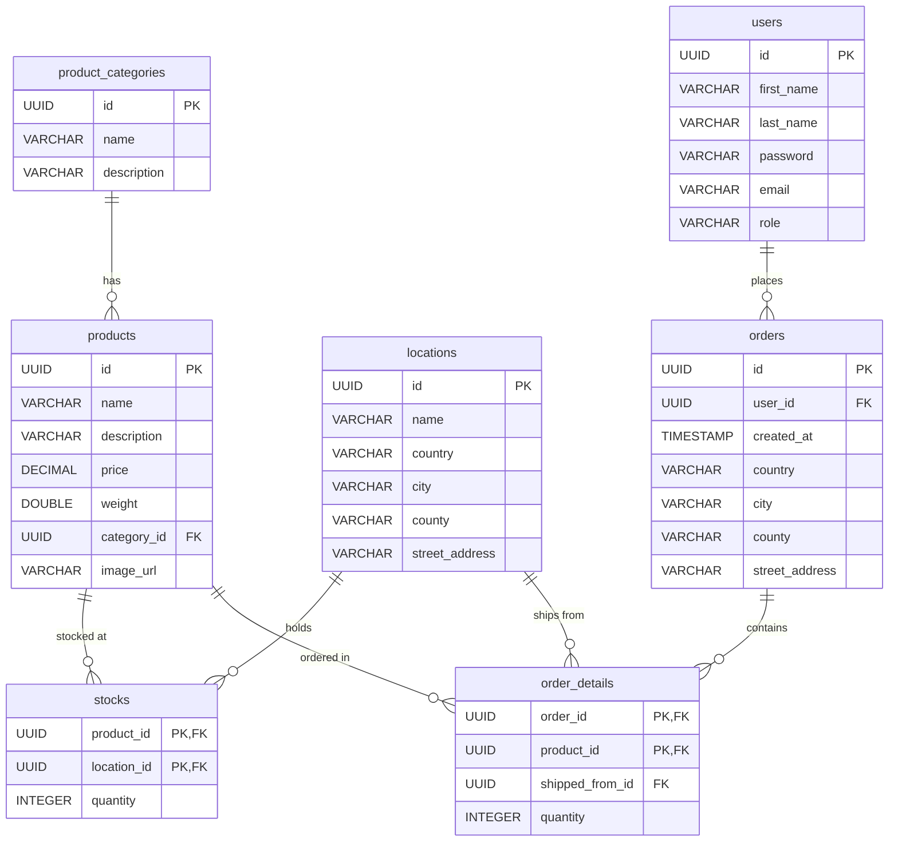

# Online Shop API

## API Documentation

You can explore and test all available endpoints using the Swagger interface:
- Swagger UI: http://localhost:3000/api/swagger-ui/index.html

## Local Setup

### Starting the App

You can start the backend locally in one of two ways:

#### Option 1: Using Maven

Activate the `local` profile to use preconfigured dev credentials:

```bash
mvn spring-boot:run -Dspring-boot.run.profiles=local
```

#### Option 2: Using IntelliJ Run Configurations

Use the predefined IntelliJ run configurations from the `.run/` folder:

| Configuration | Description                                                     |
|---------------|-----------------------------------------------------------------|
| `api:local`   | Runs the app via IntelliJ with `-Dspring.profiles.active=local` |

### Mock Users (local profile)

The V1.1 migration seeds the following users (all passwords are `password`):

| Email                  | Role     |
|------------------------|----------|
| admin@onlineshop.com   | ADMIN    |
| john.doe@email.com     | CUSTOMER |
| jane.smith@email.com   | CUSTOMER |

## Database Schema

> To render Mermaid diagrams in IntelliJ, install the [Mermaid plugin](https://plugins.jetbrains.com/plugin/20146-mermaid).


## Production Configuration

For deployed environments, all sensitive values must be provided via environment variables.

| Variable             | Description                     |
|----------------------|---------------------------------|
| DB_HOST              | Database host address           |
| DB_PORT              | Database port                   |
| DB_NAME              | Database name                   |
| DB_USERNAME          | Database username               |
| DB_PASSWORD          | Database password               |
| JWT_SECRET           | Secret key used for JWT signing |
| CORS_ALLOWED_ORIGINS | Allowed client origins for CORS |